# UI Flow: Campus Service Request and Maintenance System

## 1. Pendahuluan

Dokumen ini menggambarkan seluruh alur interaksi pengguna (*user flow*) pada sistem **Campus Service Request and Maintenance System**. Setiap alur mendeskripsikan langkah-langkah yang dilalui pengguna dari titik awal (*trigger*) hingga kondisi akhir (*end state*), termasuk percabangan logika dan penanganan error.

### 1.1 Aktor

| Aktor | Peran |
|---|---|
| **Pelapor** | Mahasiswa atau dosen yang melaporkan keluhan fasilitas |
| **Administrator** | Staf admin yang meninjau, memprioritaskan, dan menugaskan teknisi |
| **Teknisi** | Staf pemeliharaan yang menerima dan mengerjakan tugas perbaikan |
| **Manajer Fasilitas** | Kepala bagian yang memantau statistik dan kinerja sistem |

### 1.2 Notasi Diagram

| Simbol | Arti |
|---|---|
| `([...])` | Titik mulai / titik akhir (Start / End) |
| `[...]` | Halaman / Screen |
| `{...}` | Decision / Percabangan logika |
| `>...]` | Aksi pengguna |
| `-->` | Alur normal |
| `-.->` | Alur alternatif / error |

### 1.3 Referensi

- [`CASE.md`](../../../CASE.md) — Deskripsi umum & alur status
- [`docs/requirements/03-specification.md`](../requirements/03-specification.md) — FR, BR, User Stories
- [`docs/design/architecture-design.md`](architecture-design.md) — Arsitektur sistem
- [`docs/design/wireframe-ui.html`](wireframe-ui.html) — Wireframe UI

---

## 2. Alur Global: Login & Autentikasi

### UF-00 — Login dan Pemilihan Peran

**Aktor:** Semua aktor  
**Trigger:** Pengguna mengakses URL aplikasi atau sesi telah berakhir  
**FR terkait:** FR-24  
**BR terkait:** —  
**End State:** Pengguna berhasil masuk dan diarahkan ke halaman utama sesuai perannya

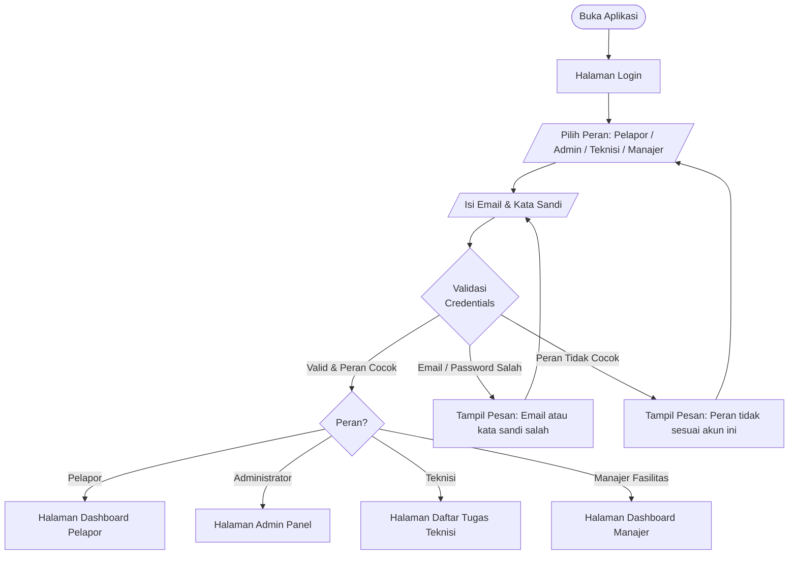

#### Langkah-Langkah

| # | Aksi Pengguna | Respons Sistem |
|---|---|---|
| 1 | Buka URL aplikasi | Tampilkan halaman login dengan role selector |
| 2 | Pilih peran dari 4 opsi yang tersedia | Highlight pilihan peran aktif |
| 3 | Isi email dan kata sandi | — |
| 4 | Klik tombol **Masuk** | Validasi credentials + kecocokan peran ke DB |
| 5a | ✅ Valid | Buat session cookie → redirect ke halaman peran |
| 5b | ❌ Email/password salah | Tampil pesan error, form tetap aktif |
| 5c | ❌ Peran tidak cocok | Tampil pesan error, minta pilih ulang peran |

#### Edge Cases

| Kondisi | Penanganan |
|---|---|
| Sesi expired saat menggunakan aplikasi | Redirect ke halaman login, tampil notifikasi "Sesi Anda telah berakhir" |
| Akun belum dibuat | Tidak ada registrasi mandiri — hubungi Administrator |

---

## 3. Alur Pelapor

### UF-01 — Membuat Laporan Baru

**Aktor:** Pelapor  
**Trigger:** Klik tombol **Buat Laporan Baru** di sidebar atau dashboard  
**FR terkait:** FR-01, FR-02, FR-03, FR-04  
**BR terkait:** BR-01, BR-09  
**End State:** Laporan tersimpan dengan status `Submitted`

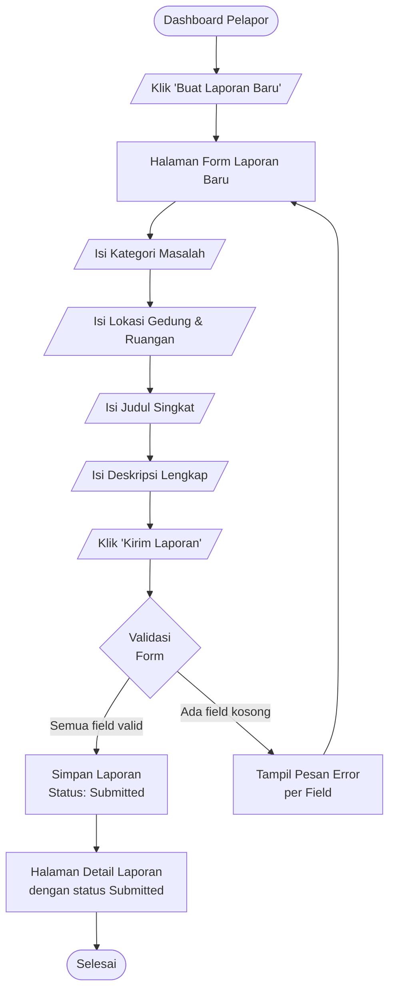

#### Langkah-Langkah

| # | Halaman | Aksi Pengguna | Respons Sistem |
|---|---|---|---|
| 1 | Dashboard | Klik **Buat Laporan Baru** | Navigasi ke form |
| 2 | Form | Pilih kategori masalah (dropdown) | — |
| 3 | Form | Pilih gedung & isi lantai/ruangan | — |
| 4 | Form | Isi judul singkat | — |
| 5 | Form | Isi deskripsi lengkap | — |
| 6 | Form | Klik **Kirim Laporan** | Validasi semua field wajib |
| 7a | — | ✅ Valid | Simpan ke DB, redirect ke detail laporan, status = `Submitted` |
| 7b | — | ❌ Ada field kosong | Tampil pesan error inline per field |

#### Kategori Masalah yang Tersedia (BR-01)

- Peralatan Presentasi (Proyektor, Layar)
- Jaringan & Internet
- Kenyamanan Ruangan (AC, Ventilasi)
- Furnitur (Kursi, Meja)
- Peralatan Laboratorium
- Kebersihan & Sanitasi

---

### UF-02 — Melihat Daftar & Mencari Laporan

**Aktor:** Pelapor  
**Trigger:** Klik menu **Laporan Saya** di sidebar  
**FR terkait:** FR-05, FR-06  
**End State:** Pengguna melihat dan/atau menemukan laporan yang dicari

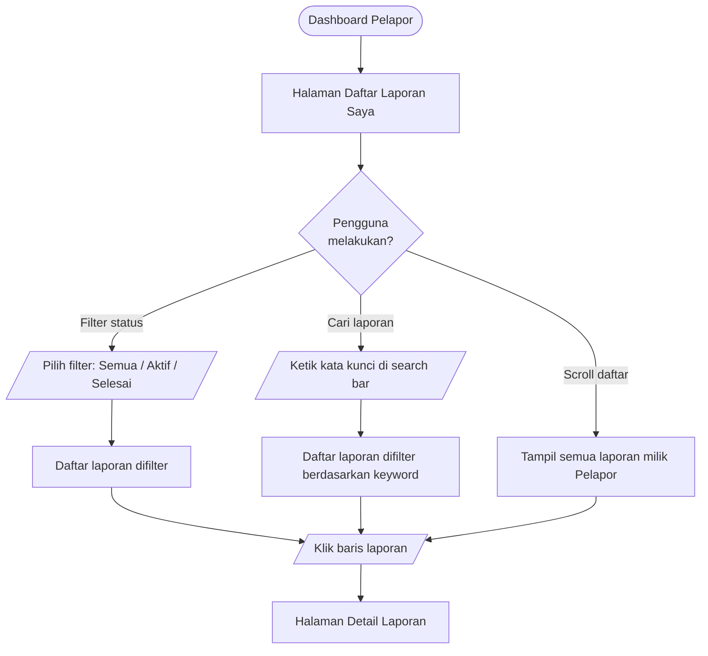

---

### UF-03 — Melihat Detail Laporan

**Aktor:** Pelapor  
**Trigger:** Klik salah satu baris laporan di daftar  
**FR terkait:** FR-07, FR-22, FR-23  
**End State:** Pengguna melihat detail lengkap laporan termasuk status terkini dan riwayat

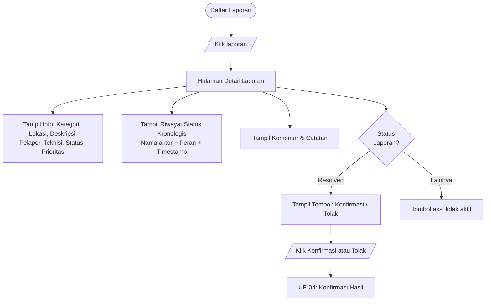

---

### UF-04 — Konfirmasi atau Tolak Hasil Perbaikan

**Aktor:** Pelapor  
**Trigger:** Laporan berstatus `Resolved`, Pelapor membuka detail laporan  
**FR terkait:** FR-19  
**BR terkait:** BR-07, BR-08  
**End State (Konfirmasi):** Administrator dapat menutup laporan → status `Closed`  
**End State (Tolak):** Administrator dapat membuka kembali → status `Reopened`

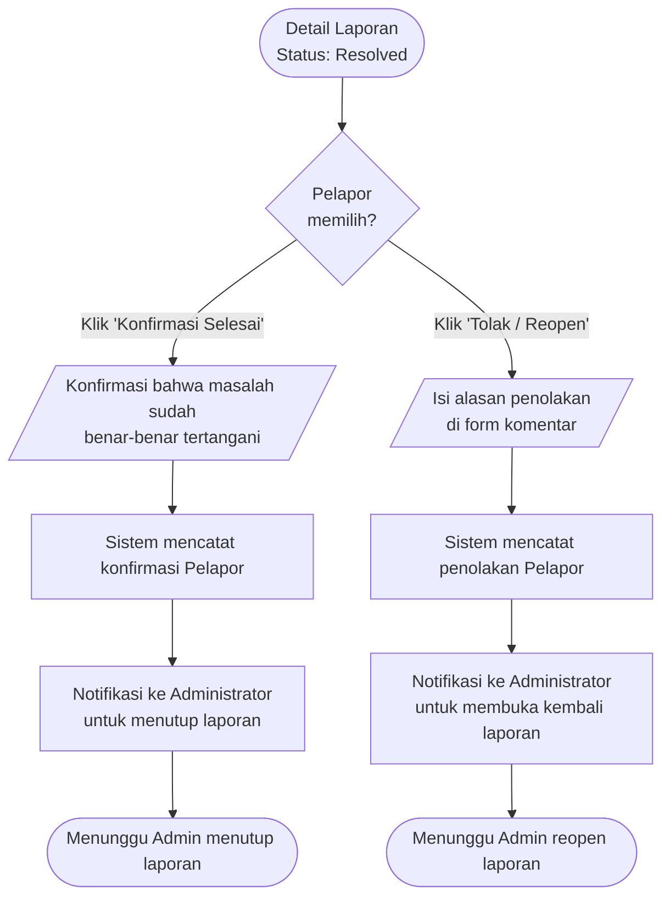

#### Skenario

| Skenario | Aksi Pelapor | Aksi Sistem | Status Berikutnya |
|---|---|---|---|
| Puas dengan hasil | Klik **Konfirmasi Selesai** | Catat konfirmasi | Menunggu Admin → `Closed` |
| Tidak puas | Klik **Tolak / Reopen** + isi alasan | Catat penolakan | Menunggu Admin → `Reopened` |

---

### UF-05 — Menambahkan Komentar pada Laporan

**Aktor:** Pelapor  
**Trigger:** Pengguna berada di halaman detail laporan  
**FR terkait:** FR-08  
**End State:** Komentar tersimpan dan tampil di thread diskusi

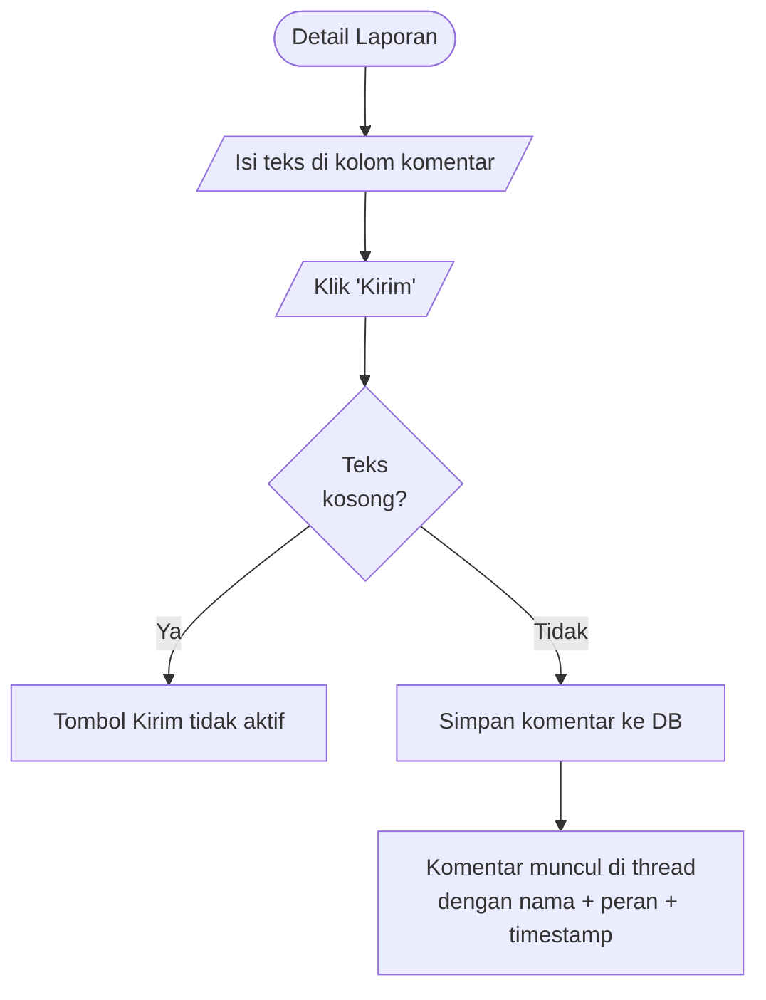

---

## 4. Alur Administrator

### UF-06 — Meninjau Laporan Masuk

**Aktor:** Administrator  
**Trigger:** Klik tombol **Tinjau** pada laporan berstatus `Submitted`  
**FR terkait:** FR-09, FR-10, FR-11  
**BR terkait:** BR-04  
**End State:** Laporan berstatus `Under Review`

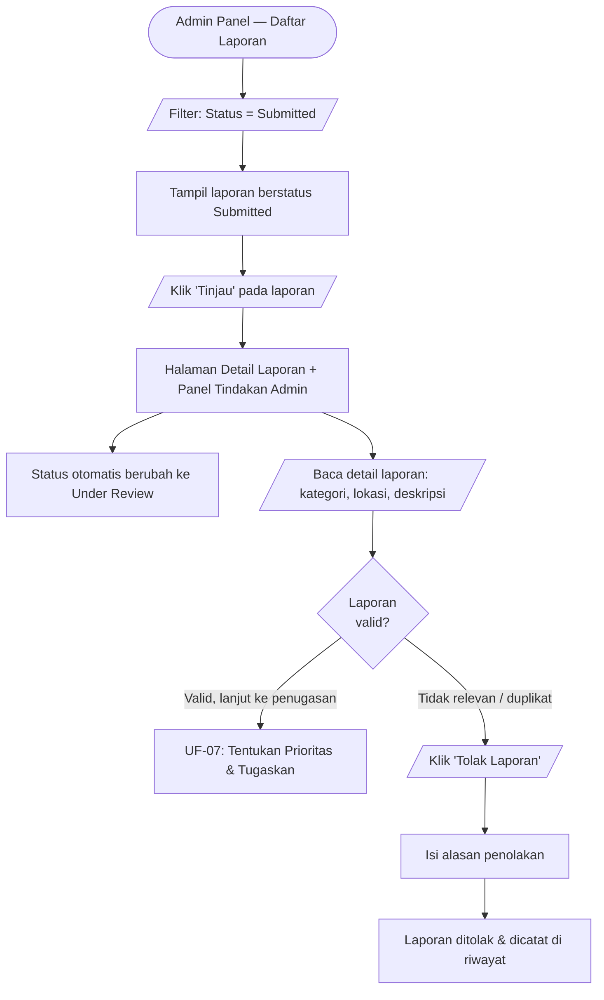

---

### UF-07 — Menentukan Prioritas & Menugaskan Teknisi

**Aktor:** Administrator  
**Trigger:** Laporan sedang ditinjau (status `Under Review`)  
**FR terkait:** FR-11, FR-12, FR-13  
**BR terkait:** BR-02, BR-04, BR-05  
**End State:** Laporan berstatus `Assigned`, teknisi mendapat tugas baru

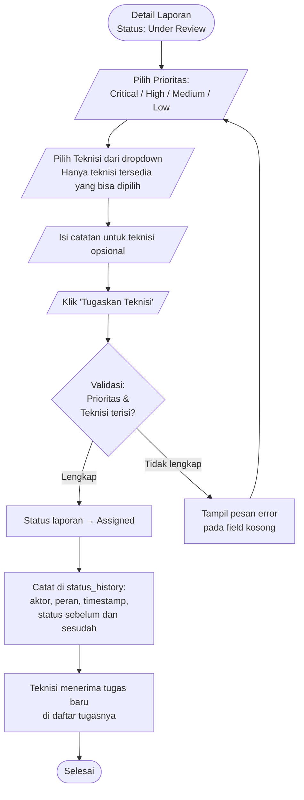

#### Aturan Pemilihan Teknisi

| Kondisi | Perilaku |
|---|---|
| Teknisi tersedia | Dapat dipilih dari dropdown |
| Teknisi sedang bertugas | Ditampilkan dengan label *(Sedang bertugas)*, tidak bisa dipilih |
| Tidak ada teknisi tersedia | Tampil pesan, Admin diminta mencoba lagi nanti |

---

### UF-08 — Menutup Laporan (Closed)

**Aktor:** Administrator  
**Trigger:** Pelapor telah mengonfirmasi hasil perbaikan  
**FR terkait:** FR-20  
**BR terkait:** BR-07  
**End State:** Laporan berstatus `Closed` secara permanen

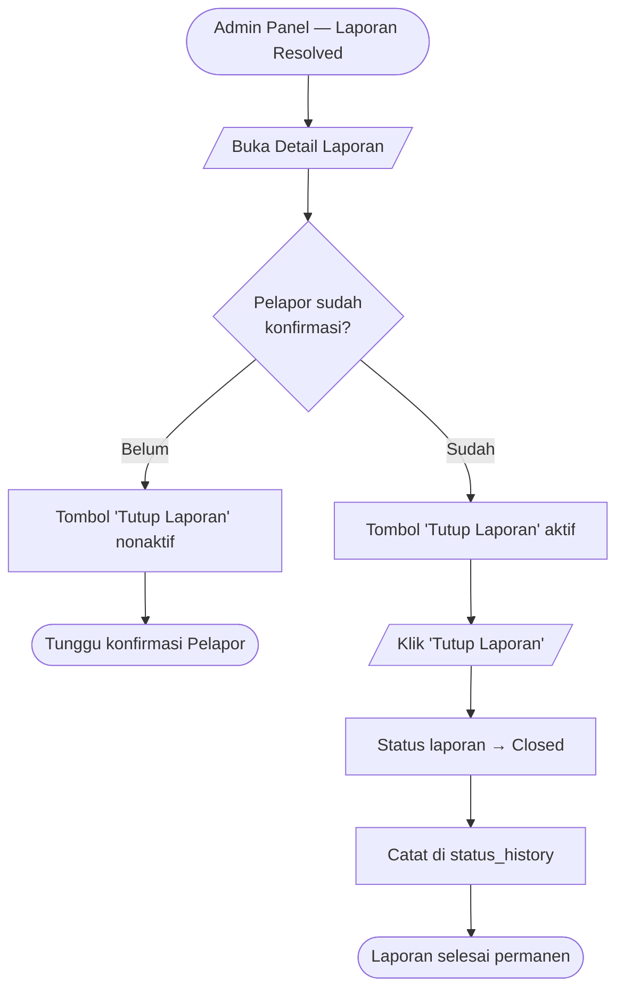

---

### UF-09 — Membuka Kembali Laporan (Reopened)

**Aktor:** Administrator  
**Trigger:** Pelapor menolak hasil perbaikan  
**FR terkait:** FR-21  
**BR terkait:** BR-08  
**End State:** Laporan berstatus `Reopened`, siap ditugaskan ulang

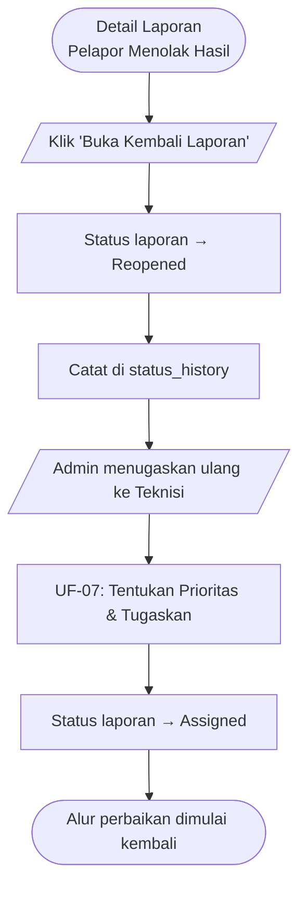

> **Catatan BR-08:** Laporan berstatus `Reopened` **wajib** ditugaskan kembali oleh Administrator sebelum statusnya dapat berubah ke `Assigned`.

---

### UF-10 — Manajemen Pengguna (Buat Akun)

**Aktor:** Administrator  
**Trigger:** Klik menu **Manajemen Pengguna** → **Buat Akun Baru**  
**FR terkait:** FR-24 (RBAC)  
**End State:** Akun baru tersimpan di DB, pengguna dapat login

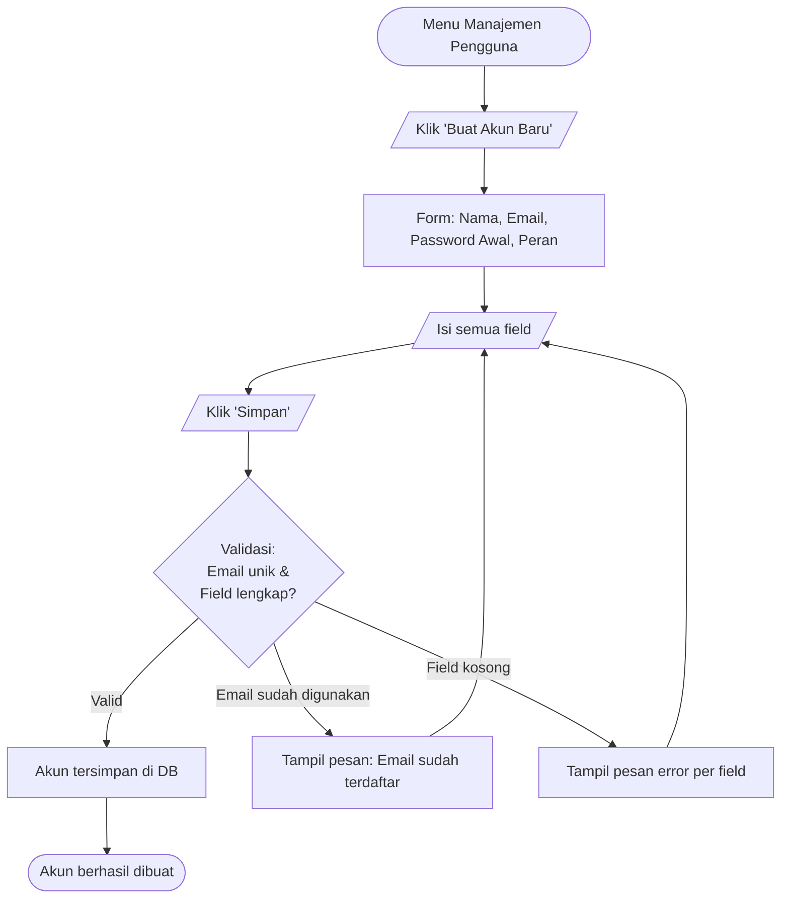

> **Catatan:** Tidak ada registrasi mandiri. Semua akun hanya dibuat oleh Administrator. Teknisi dapat menggunakan email non-kampus.

---

## 5. Alur Teknisi

### UF-11 — Melihat & Menerima Tugas

**Aktor:** Teknisi  
**Trigger:** Login sebagai Teknisi → otomatis masuk ke halaman Daftar Tugas  
**FR terkait:** FR-14, FR-15, FR-16  
**BR terkait:** BR-06  
**End State:** Tugas diterima, status laporan berubah ke `In Progress`

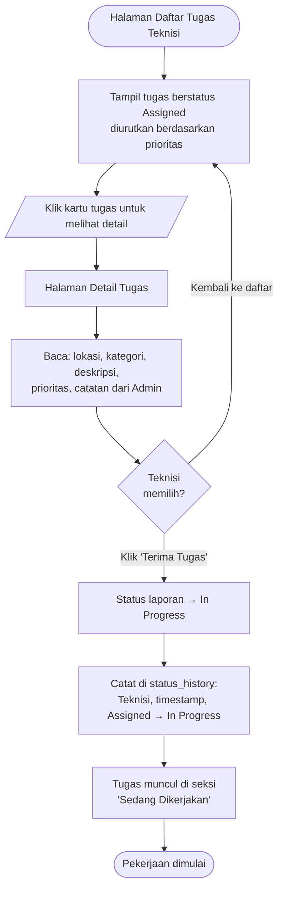

---

### UF-12 — Memperbarui Progres Pengerjaan

**Aktor:** Teknisi  
**Trigger:** Tugas berstatus `In Progress`, Teknisi ingin update catatan pekerjaan  
**FR terkait:** FR-17  
**BR terkait:** BR-06  
**End State:** Komentar progres tersimpan dan tampil di thread laporan

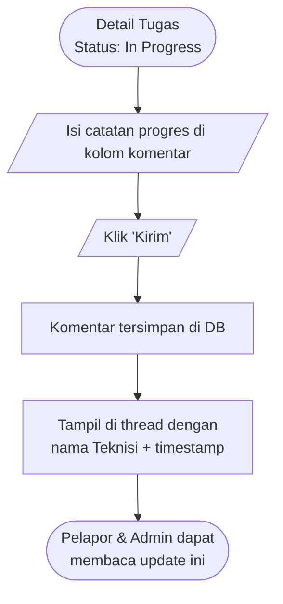

---

### UF-13 — Menandai Pekerjaan Selesai

**Aktor:** Teknisi  
**Trigger:** Pekerjaan selesai, Teknisi siap melaporkan hasil  
**FR terkait:** FR-18  
**BR terkait:** BR-06  
**End State:** Status laporan berubah ke `Resolved`, menunggu konfirmasi Pelapor

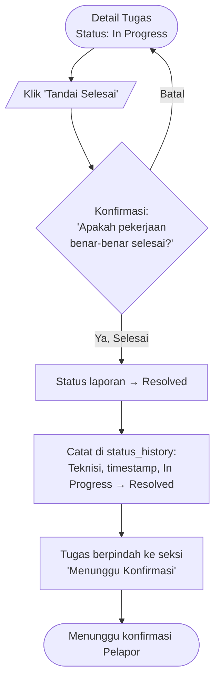

---

## 6. Alur Manajer Fasilitas

### UF-14 — Melihat Dashboard Statistik

**Aktor:** Manajer Fasilitas  
**Trigger:** Login sebagai Manajer → otomatis masuk ke Dashboard  
**FR terkait:** FR-25, FR-26, FR-27  
**End State:** Manajer membaca ringkasan data fasilitas

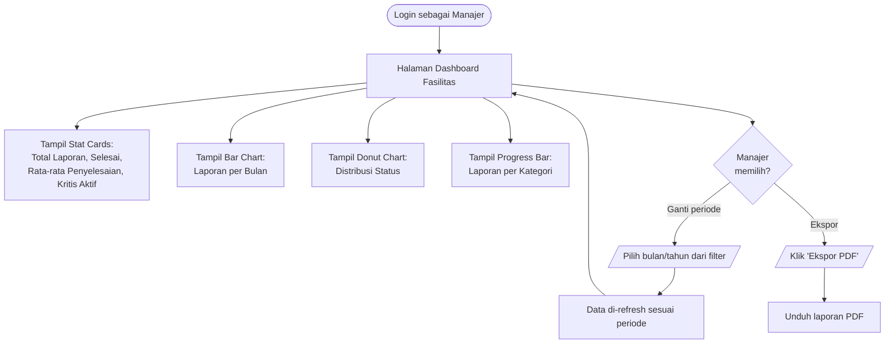

---

## 7. Alur Status Laporan (Master Flow)

Diagram berikut menggambarkan **seluruh transisi status** yang dapat terjadi pada sebuah laporan, beserta aktor pemicunya.

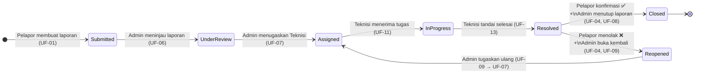

### Tabel Transisi Status

| Dari | Ke | Aktor | Alur | FR |
|---|---|---|---|---|
| *(Baru)* | `Submitted` | Pelapor | UF-01 | FR-04 |
| `Submitted` | `Under Review` | Administrator | UF-06 | FR-09 |
| `Under Review` | `Assigned` | Administrator | UF-07 | FR-12, FR-13 |
| `Assigned` | `In Progress` | Teknisi | UF-11 | FR-15, FR-16 |
| `In Progress` | `Resolved` | Teknisi | UF-13 | FR-18 |
| `Resolved` | `Closed` | Administrator | UF-08 | FR-20 |
| `Resolved` | `Reopened` | Administrator | UF-09 | FR-21 |
| `Reopened` | `Assigned` | Administrator | UF-09 → UF-07 | BR-08, FR-12 |

---

## 8. Screen Mapping

Pemetaan setiap halaman UI ke alur yang menggunakannya.

| Screen / Halaman | URL | Alur yang Menggunakan | Aktor |
|---|---|---|---|
| Halaman Login | `/login` | UF-00 | Semua |
| Dashboard Pelapor | `/pelapor/laporan` | UF-02 | Pelapor |
| Form Laporan Baru | `/pelapor/laporan/baru` | UF-01 | Pelapor |
| Detail Laporan (Pelapor) | `/pelapor/laporan/:id` | UF-03, UF-04, UF-05 | Pelapor |
| Admin Panel — Daftar | `/admin/laporan` | UF-06 | Administrator |
| Admin — Detail & Tinjau | `/admin/laporan/:id` | UF-06, UF-07, UF-08, UF-09 | Administrator |
| Admin — Manajemen User | `/admin/pengguna` | UF-10 | Administrator |
| Daftar Tugas Teknisi | `/teknisi/tugas` | UF-11 | Teknisi |
| Detail Tugas Teknisi | `/teknisi/tugas/:id` | UF-11, UF-12, UF-13 | Teknisi |
| Dashboard Manajer | `/manajer/dashboard` | UF-14 | Manajer Fasilitas |

---

## 9. Edge Cases & Penanganan Error

| Kode | Skenario | Penanganan |
|---|---|---|
| EC-01 | Pengguna mengakses URL halaman peran lain | Redirect ke halaman perannya sendiri (RBAC) |
| EC-02 | Sesi kadaluarsa saat mengisi form | Redirect ke login, data form hilang — tampilkan pesan peringatan |
| EC-03 | Tidak ada teknisi tersedia saat Admin ingin menugaskan | Tampil pesan: *"Tidak ada teknisi tersedia saat ini"*, Admin menunggu |
| EC-04 | Pelapor mencoba akses detail laporan milik orang lain | Tampil halaman 403 Forbidden |
| EC-05 | Teknisi mencoba akses detail laporan bukan tugasnya | Tampil halaman 403 Forbidden |
| EC-06 | Laporan dihapus atau tidak ditemukan | Tampil halaman 404 Not Found |
| EC-07 | Koneksi internet terputus saat submit form | Tampil pesan error jaringan, data form tetap tersimpan di lokal |
| EC-08 | Teknisi klik "Tandai Selesai" dua kali | Tombol dinonaktifkan setelah klik pertama untuk mencegah duplikasi |

---

## 10. Status Dokumen

| Item | Detail |
|---|---|
| **Versi** | 1.0.0 |
| **Tanggal** | 1 Juli 2026 |
| **Dibuat oleh** | Antigravity AI |
| **Referensi Wireframe** | [`wireframe-ui.html`](wireframe-ui.html) |
| **Status** | ✅ Draft Final |

Dokumen ini disusun berdasarkan:
- [`CASE.md`](../../../CASE.md)
- [`docs/requirements/01-inception.md`](../requirements/01-inception.md)
- [`docs/requirements/03-specification.md`](../requirements/03-specification.md)
- [`docs/design/architecture-design.md`](architecture-design.md)
