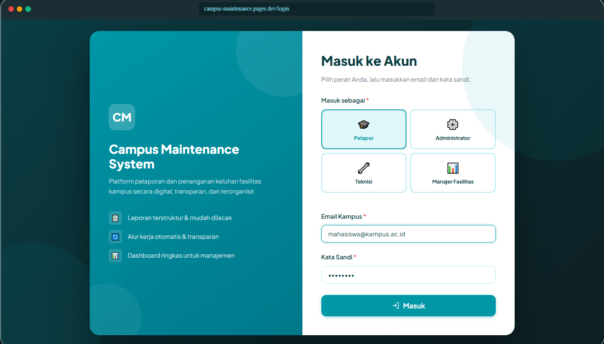

# Wireframe Result — Campus Maintenance System

Dokumen ini merangkum semua wireframe antarmuka yang dirancang untuk sistem **Campus Maintenance**. Setiap halaman mewakili alur kerja pengguna sesuai perannya (Pelapor, Manajer, Teknisi, dan Admin).

---

## 1. Halaman Login

Halaman autentikasi untuk semua peran pengguna (Pelapor, Manajer, Teknisi, Admin).

---

## 2. Dashboard Pelapor

Halaman utama bagi pengguna dengan peran **Pelapor**. Menampilkan ringkasan laporan yang telah diajukan beserta statusnya.

---

## 3. Form Laporan

Formulir yang digunakan oleh **Pelapor** untuk mengajukan laporan kerusakan atau permasalahan fasilitas kampus.

---

## 4. Detail Laporan

Halaman detail laporan yang menampilkan informasi lengkap terkait laporan yang telah diajukan, termasuk status dan riwayat penanganan.

---

## 5. Dashboard Manajer

Halaman utama bagi pengguna dengan peran **Manajer**. Memberikan gambaran keseluruhan laporan masuk, laporan dalam proses, dan statistik penanganan.

---

## 6. Tinjau dan Tugaskan

Halaman yang digunakan **Manajer** untuk meninjau laporan masuk dan menugaskan teknisi yang bertanggung jawab.

---

## 7. Tugas Teknisi

Halaman bagi **Teknisi** untuk melihat daftar tugas yang telah ditugaskan oleh manajer dan memperbarui status penanganan.

---

## 8. Admin Panel

Halaman pengelolaan sistem bagi **Admin**, mencakup manajemen pengguna, konfigurasi sistem, dan akses data keseluruhan.

---

## Ringkasan Halaman

| No | Nama Halaman          | Peran Pengguna         | Keterangan                                     |
|----|-----------------------|------------------------|------------------------------------------------|
| 1  | Login                 | Semua Peran            | Autentikasi pengguna                           |
| 2  | Dashboard Pelapor     | Pelapor                | Ringkasan laporan yang diajukan                |
| 3  | Form Laporan          | Pelapor                | Pengajuan laporan kerusakan                    |
| 4  | Detail Laporan        | Pelapor, Manajer       | Detail dan riwayat laporan                     |
| 5  | Dashboard Manajer     | Manajer                | Overview laporan & statistik                   |
| 6  | Tinjau dan Tugaskan   | Manajer                | Review laporan & assign teknisi                |
| 7  | Tugas Teknisi         | Teknisi                | Daftar tugas & update status penanganan        |
| 8  | Admin Panel           | Admin                  | Manajemen pengguna & konfigurasi sistem        |
